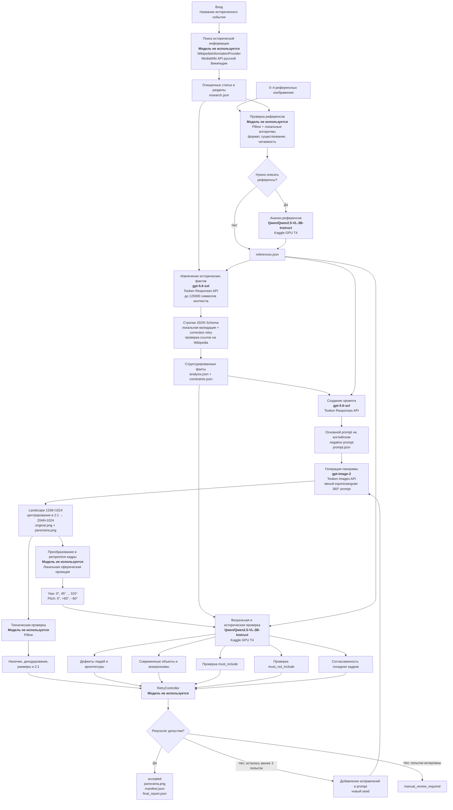

# Current Historical Panorama Pipeline

## Используемые модели

| Назначение | Модель | Запуск |
|---|---|---|
| Извлечение исторических фактов | `gpt-5.6-sol` | Tooken Club, Responses API |
| Создание промпта | `gpt-5.6-sol` | Tooken Club, Responses API |
| Генерация панорамы | `gpt-image-2` | Tooken Club, Images API |
| Анализ референсов | `Qwen/Qwen2.5-VL-3B-Instruct` | Kaggle, T4 |
| Визуальная и историческая проверка | `Qwen/Qwen2.5-VL-3B-Instruct` | Kaggle, T4 |

Число мультимодальных проверок задаётся `pipeline.visual_validation_runs`: `0` отключает
их, значения `1–5` запускают указанное количество независимых проверок каждой попытки.
Детерминированную техническую проверку можно отключить параметром
`pipeline.technical_validation_enabled` или флагом `--skip-technical-validation`.

## Этапы без моделей

- Поиск и парсинг Википедии — `WikipediaInformationProvider` и MediaWiki API.
- Проверка файлов референсов — Pillow.
- Проверка наличия, читаемости, размеров и 2:1 — Pillow.
- Создание perspective-кадров — локальная сферическая проекция.
- Решение о повторной генерации — `RetryController`, максимум три полные генерации.
- Сохранение и восстановление — JSON-артефакты, `state.json` и параметр `--resume`.

Kaggle-провайдеры `Qwen/Qwen2.5-7B-Instruct`, SDXL и Stable Diffusion 3.5 Medium
остаются зарегистрированными альтернативами и выбираются независимо в YAML или Admin UI.
