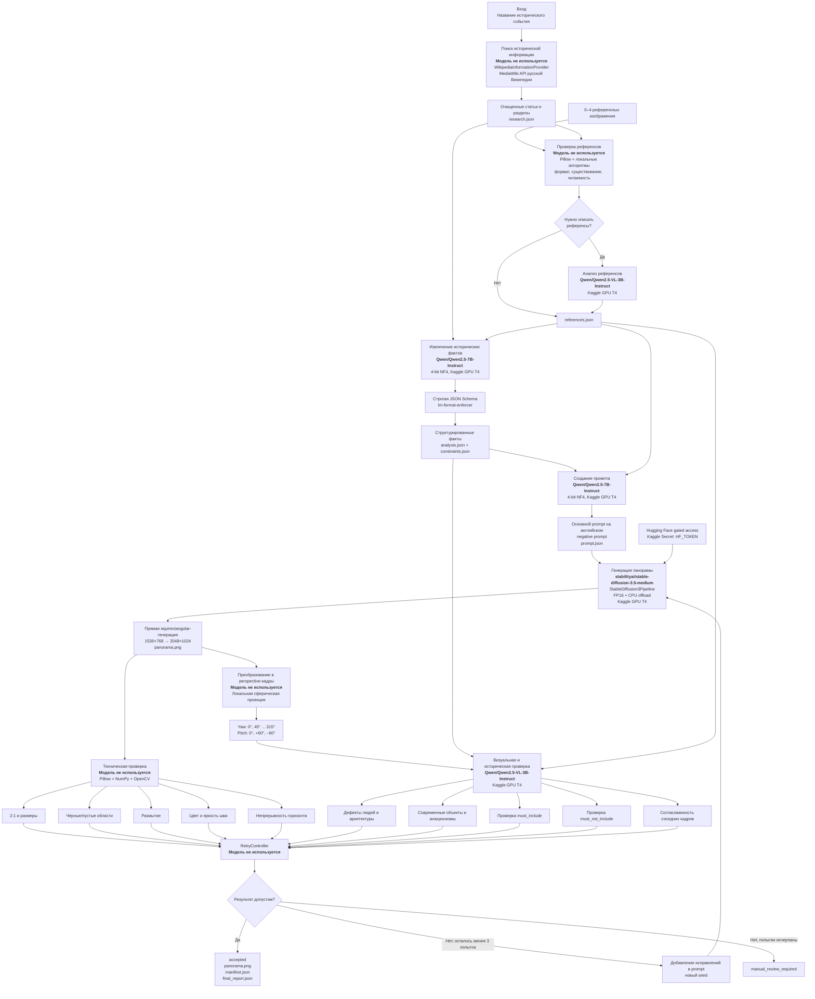

# Current Historical Panorama Pipeline

## Используемые модели

| Назначение | Модель | Запуск |
|---|---|---|
| Извлечение исторических фактов | `Qwen/Qwen2.5-7B-Instruct` | Kaggle, T4, 4-bit NF4 |
| Создание промпта | `Qwen/Qwen2.5-7B-Instruct` | Kaggle, T4, 4-bit NF4 |
| Генерация панорамы | `stabilityai/stable-diffusion-3.5-medium` | Kaggle, T4, FP16 + CPU offload |
| Анализ референсов | `Qwen/Qwen2.5-VL-3B-Instruct` | Kaggle, T4 |
| Визуальная и историческая проверка | `Qwen/Qwen2.5-VL-3B-Instruct` | Kaggle, T4 |

## Этапы без моделей

- Поиск и парсинг Википедии — `WikipediaInformationProvider` и MediaWiki API.
- Проверка файлов референсов — Pillow.
- Проверка размеров, размытия и шва — Pillow, NumPy и OpenCV.
- Создание perspective-кадров — локальная сферическая проекция.
- Решение о повторной генерации — `RetryController`, максимум три полные генерации.
- Сохранение и восстановление — JSON-артефакты, `state.json` и параметр `--resume`.
