# Поток данных Historical Panorama Pipeline

Диаграмма показывает текущую конфигурацию `config.yaml`, фактические входы и выходы
каждого этапа, точки сохранения состояния и цикл повторной генерации.

```mermaid
flowchart TB
    classDef input fill:#e8f1ff,stroke:#3973b9,color:#10243e
    classDef parser fill:#e9f8ef,stroke:#318457,color:#153c29
    classDef model fill:#fff2d9,stroke:#c17b14,color:#4f3208
    classDef artifact fill:#f3edff,stroke:#7651b5,color:#2c174c
    classDef decision fill:#ffe9e9,stroke:#b74747,color:#4f1717
    classDef optional fill:#f1f1f1,stroke:#777,color:#333,stroke-dasharray: 5 5
    classDef result fill:#ddf8f5,stroke:#18877c,color:#083d38

    subgraph IN["Вход"]
        U["1. Запрос пользователя<br/><code>event: Строительство крепости Свияжск в 1551 году</code>"]:::input
        RI["0–4 референса, необязательно<br/><code>{path: reference.jpg,<br/>use_for: [clothing],<br/>do_not_copy: [background]}</code>"]:::input
        CFG["config.yaml<br/><code>GPT-5.6 Sol · GPT Image 2<br/>Qwen2.5-VL · attempts=3</code>"]:::input
    end

    subgraph RESEARCH["Сбор и подготовка данных"]
        W["2. WikipediaInformationProvider<br/>MediaWiki API · без модели<br/>redirects, disambiguation, очистка,<br/>основная + до 6 связанных статей"]:::parser
        R[("research.json<br/><code>primary_article: Свияжск<br/>section: История<br/>text: ...</code>")]:::artifact

        RV["3. ReferenceProcessor<br/>Pillow · без модели<br/>существование, формат, читаемость"]:::parser
        RA{"Есть valid reference<br/>и непустой use_for?"}:::decision
        CAP{"Генератор поддерживает<br/>image conditioning?"}:::decision
        DIRECT["Прямой visual conditioning<br/><code>reference_paths + исходные байты</code><br/>для совместимых реализаций<br/>image generator"]:::optional
        QREF["Fallback: Qwen2.5-VL-3B-Instruct<br/>Kaggle T4<br/>описывает только категории use_for"]:::model
        RR[("references.json<br/><code>valid: true<br/>description: деревянный кафтан...<br/>issues: []</code>")]:::artifact
    end

    U -->|"строка event"| W
    W -->|"очищенные Source[] + metadata + limitations"| R
    RI --> RV
    RV --> RA
    RA -->|"нет"| RR
    RA -->|"да"| CAP
    CAP -->|"да"| DIRECT
    CAP -->|"нет"| QREF
    DIRECT --> RR
    QREF -->|"текстовое описание деталей"| RR

    subgraph GROUNDING["Историческое заземление"]
        FE["4. HistoricalFactExtractor<br/><b>GPT-5.6 Sol</b> · Tooken Responses API<br/>вход: только очищенная Wikipedia"]:::model
        AN[("analysis.json + constraints.json<br/><code>date_or_period: 1551<br/>architecture: [деревянная крепость]<br/>confidence: supported<br/>article: Свияжск<br/>section: История</code>")]:::artifact
        PB["5. PromptBuilder<br/><b>GPT-5.6 Sol</b> · Tooken Responses API<br/>вход: analysis + constraints + references<br/>сырой Wikipedia-текст сюда не передаётся"]:::model
        PR[("prompt.json<br/><code>prompt: Seamless equirectangular...<br/>negative_prompt: modern objects, text...<br/>used_facts: [...]<br/>sources: [...]</code>")]:::artifact
    end

    R -->|"Wikipedia sections"| FE
    FE -->|"строгий JSON + source citations"| AN
    AN --> PB
    RR --> PB
    PB --> PR

    subgraph ATTEMPT["Попытка генерации 1…3"]
        AP["6. Attempt prompt<br/><code>attempt: 1<br/>seed: 42</code><br/>При retry добавляется:<br/><code>Regeneration correction: ...</code>"]:::parser
        IG["7. ImageGenerator<br/><b>gpt-image-2</b> · Tooken Images API<br/>текущий provider: text-to-image<br/>явный 360° × 180° equirectangular prompt<br/><i>другой provider может принять references</i>"]:::model
        ORIG[("original.png<br/><code>1536×1024</code>")]:::artifact
        PANO[("panorama.png<br/><code>2048×1024 · 2:1</code><br/>generation.json: model, prompt,<br/>quality, elapsed time, path")]:::artifact
    end

    PR --> AP
    AP --> IG
    DIRECT -. "исходные файлы + use_for/do_not_copy" .-> IG
    IG --> ORIG
    ORIG -->|"center crop до 2:1 + resize"| PANO

    subgraph CHECKS["Проверки результата"]
        TV{"8A. technical_validation_enabled?"}:::decision
        TECH["TechnicalPanoramaValidator<br/>Pillow · без модели<br/>файл, декодирование,<br/>размеры, точное 2:1"]:::parser
        TR[("technical_validation.json<br/><code>status: passed | failed | disabled<br/>checks: [{name: dimensions,...}]</code>")]:::artifact

        VV{"8B. visual_validation_runs<br/>0 или 1–5?"}:::decision
        PROJ["PerspectiveProjector<br/>локальная сферическая проекция<br/>10 кадров 512×512<br/>yaw 0…315°, pitch 0°, +60°, −60°"]:::parser
        FR[("perspective_frames/<br/><code>frame_03_yaw_090_pitch_+00.png<br/>frames.json: yaw, pitch, path</code>")]:::artifact
        QVAL["Qwen2.5-VL-3B-Instruct<br/>Kaggle T4 · каждый запуск отдельно<br/>вход: 10 кадров + analysis + constraints<br/>+ текстовые сведения о references"]:::model
        VR[("visual_validation_01.json …<br/>visual_validation.json<br/><code>severity: critical<br/>scope: global<br/>suggested_fix: remove modern car</code>")]:::artifact
    end

    PANO --> TV
    TV -->|"да"| TECH
    TV -->|"нет"| TR
    TECH --> TR

    PANO --> VV
    VV -->|"0: выключено"| VR
    VV -->|"1–5"| PROJ
    PROJ --> FR
    FR --> QVAL
    AN --> QVAL
    RR -->|"metadata/description, не исходные фото"| QVAL
    QVAL -->|"строгий JSON Schema"| VR

    subgraph CONTROL["Решение и повторные попытки"]
        RC["9. RetryController · без модели<br/>учитывает failed technical checks<br/>и только visual issues severity=critical"]:::decision
        OK{"Критических причин<br/>отклонения нет?"}:::decision
        FIX["Конкретная коррекция промпта<br/><code>remove the modern vehicle;<br/>preserve an exact 2:1 canvas</code>"]:::parser
        LIMIT{"Попыток меньше 3?"}:::decision
    end

    TR --> RC
    VR --> RC
    RC --> OK
    OK -->|"да"| ACCEPT
    OK -->|"нет"| LIMIT
    LIMIT -->|"да"| FIX
    FIX -->|"новый seed + correction"| AP
    LIMIT -->|"нет"| REVIEW

    subgraph OUT["Итог"]
        ACCEPT["accepted"]:::result
        REVIEW["manual_review_required"]:::result
        FINAL[("panorama.png<br/>manifest.json<br/>final_report.json<br/><code>status, attempts,<br/>rejection_reasons</code>")]:::artifact
    end

    ACCEPT --> FINAL
    REVIEW --> FINAL

    subgraph STATE["Сохранение и resume"]
        ST[("state.json<br/><code>stage: prompt_complete<br/>current_attempt: 1<br/>status: running</code>")]:::artifact
        RES["--resume RUN_DIR<br/>переиспользует завершённые<br/>research/references/analysis/prompt<br/>и уже сгенерированные попытки"]:::optional
    end

    R -. "атомарное сохранение" .-> ST
    RR -. "атомарное сохранение" .-> ST
    AN -. "атомарное сохранение" .-> ST
    PR -. "атомарное сохранение" .-> ST
    PANO -. "атомарное сохранение" .-> ST
    TR -. "атомарное сохранение" .-> ST
    VR -. "атомарное сохранение" .-> ST
    FINAL -. "complete" .-> ST
    ST --> RES
    RES -. "продолжение с последнего артефакта" .-> AP

    CFG -. "выбор providers и параметров" .-> W
    CFG -.-> FE
    CFG -.-> PB
    CFG -.-> IG
    CFG -.-> QVAL
```



## Пример данных по этапам

### 1. Вход пользователя

```json
{
  "event": "Строительство крепости Свияжск в 1551 году",
  "references": [
    {
      "path": "reference.jpg",
      "use_for": ["clothing", "weapon_shape"],
      "do_not_copy": ["background", "composition"]
    }
  ]
}
```

Референсы необязательны. Абстрактный интерфейс допускает два маршрута: совместимый image
generator получает исходные файлы непосредственно как visual conditioning; генератор без этой
возможности получает текстовое описание, созданное Qwen2.5-VL только по `use_for`. Текущий
Tooken `/images/generations` относится ко второму маршруту, хотя сама модель GPT Image 2 в
других API-интеграциях способна принимать изображения.

### 2. Материалы Wikipedia

Сокращённый пример `research.json`:

```json
{
  "query": "Строительство крепости Свияжск в 1551 году",
  "primary_article": "Свияжск",
  "related_articles": ["Казанские походы", "Свияжская крепость"],
  "metadata": {
    "title": "Свияжск",
    "date_or_period": "1551 год",
    "place": "у впадения Свияги в Волгу",
    "participants": ["Иван IV", "русские горододельцы"]
  },
  "sources": [
    {
      "article_title": "Свияжск",
      "section": "История",
      "url": "https://ru.wikipedia.org/wiki/...",
      "text": "Очищенный текст раздела...",
      "is_primary": true,
      "relevance": 1.0
    }
  ],
  "limitations": []
}
```

### 3. Структурированный исторический анализ

Сокращённый пример `analysis.json`:

```json
{
  "identified_event": "Строительство крепости Свияжск",
  "date_or_period": "1551 год",
  "place": "Круглая гора у реки Свияги",
  "participants": ["горододельцы", "воины"],
  "event_type": "строительство крепости",
  "architecture": ["деревянные стены", "деревянные башни"],
  "visual_actions": ["сборка заранее подготовленных секций стен"],
  "facts": [
    {
      "statement": "Крепость была возведена из деревянных конструкций.",
      "category": "architecture",
      "confidence": "supported",
      "article": "Свияжск",
      "section": "История"
    }
  ],
  "constraints": {
    "must_include": ["деревянное строительство крепостных стен"],
    "may_include": ["перевозка строительных секций"],
    "must_not_include": ["современные здания", "автомобили"],
    "do_not_over_specify": ["точный декоративный облик неизвестных башен"]
  }
}
```

### 4. Финальный промпт

Сокращённый пример `prompt.json`:

```json
{
  "prompt": "Seamless equirectangular 360-degree panorama, strict 2:1 aspect ratio, full 360° × 180° spherical view, camera at human eye level... Workers assemble timber fortress walls on a hill above the Sviyaga River...",
  "negative_prompt": "modern objects, text, visible dates, city names, maps, watermark, mirrored duplicates, visible seam...",
  "metadata": {
    "provider": "openai_compatible",
    "model_id": "gpt-5.6-sol"
  },
  "used_facts": ["..."],
  "sources": ["..."]
}
```

### 5. Результат генерации

Сокращённый пример `generation.json`:

```json
{
  "attempt": 1,
  "seed": 42,
  "seed_applied": false,
  "provider": "openai_compatible",
  "model_id": "gpt-image-2",
  "requested_size": "1536x1024",
  "width": 2048,
  "height": 1024,
  "quality": "high",
  "elapsed_seconds": 48.2,
  "result_path": "runs/.../attempts/attempt_01/panorama.png"
}
```

`seed_applied: false` означает, что значение сохраняется для воспроизводимости отчёта, но
Tooken Images API в текущем запросе не получает параметр `seed`.

### 6. Техническая проверка

```json
{
  "status": "passed",
  "checks": [
    {"name": "file_exists", "measured_value": true, "status": "passed"},
    {"name": "image_readable", "measured_value": true, "status": "passed"},
    {"name": "dimensions", "measured_value": "2048x1024", "status": "passed"},
    {"name": "aspect_ratio_2_to_1", "measured_value": 2.0, "status": "passed"}
  ]
}
```

Проверки содержимого, размытия и шва здесь отсутствуют. При выключении этапа сохраняется
`{"status": "disabled", "checks": []}`.

### 7. Perspective-кадры

```json
[
  {"frame_number": 1, "yaw": 0.0, "pitch": 0.0, "path": "...frame_01...png"},
  {"frame_number": 2, "yaw": 45.0, "pitch": 0.0, "path": "...frame_02...png"},
  {"frame_number": 9, "yaw": 0.0, "pitch": 60.0, "path": "...frame_09...png"},
  {"frame_number": 10, "yaw": 0.0, "pitch": -60.0, "path": "...frame_10...png"}
]
```

### 8. Мультимодальная проверка

```json
{
  "status": "failed",
  "issues": [
    {
      "error_type": "modern_object",
      "description": "A modern vehicle is visible near the wall.",
      "frame_number": 3,
      "yaw": 90.0,
      "pitch": 0.0,
      "severity": "critical",
      "scope": "global",
      "suggested_fix": "Remove every modern vehicle from the panorama."
    }
  ],
  "explanation": "A modern object contradicts must_not_include."
}
```

`warning` и `major` сохраняются в отчёте, но текущий `RetryController` отклоняет попытку
только из-за `critical` либо проваленной технической проверки.

### 9. Решение и итог

Пример `attempt_report.json` при повторной генерации:

```json
{
  "attempt": 1,
  "decision": {
    "status": "retry_full_generation",
    "retry": true,
    "use_inpainting": false,
    "correction": "Remove every modern vehicle from the panorama.",
    "reasons": ["modern_object: A modern vehicle is visible near the wall."]
  }
}
```

Пример `final_report.json`:

```json
{
  "status": "accepted",
  "attempts": 2,
  "rejection_reasons": [],
  "technical_validation_status": "passed",
  "visual_validation_status": "passed",
  "visual_validation_available": true
}
```

## Какие компоненты выполняют этапы

| Этап | Текущий компонент | Где выполняется |
|---|---|---|
| Wikipedia | `WikipediaInformationProvider` | локальный Python + MediaWiki API |
| Проверка файлов референсов | `ReferenceProcessor` / Pillow | локально |
| Описание референсов | `Qwen/Qwen2.5-VL-3B-Instruct` | Kaggle T4 |
| Извлечение фактов | `gpt-5.6-sol` | Tooken Responses API |
| Создание промпта | `gpt-5.6-sol` | Tooken Responses API |
| Генерация | `gpt-image-2` | Tooken Images API |
| Проверка файла, размера и 2:1 | `TechnicalPanoramaValidator` / Pillow | локально |
| Perspective-проекция | `PerspectiveProjector` / NumPy + Pillow | локально |
| Визуальная/историческая проверка | `Qwen/Qwen2.5-VL-3B-Instruct` | Kaggle T4 |
| Retry-решение | `RetryController` | локально |
| Состояние и resume | `RunState` / JSON | локально |
